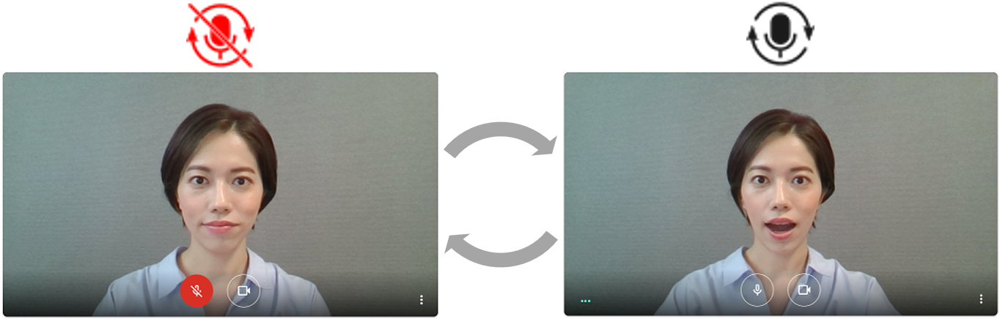
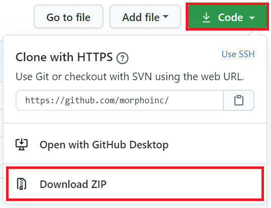
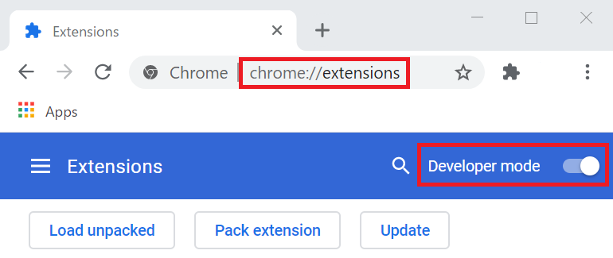
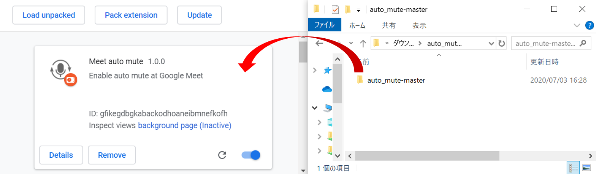
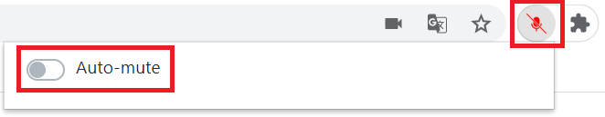

<a href="/README_ja.md">[言語: 日本語]</a>

# Auto Mute 
A Chrome extension which controls the mute function of [Google Meet](https://meet.google.com/) automatically with image recognition and voice recognition.

## System requirement
Google Chrome 
* tested version: Chrome 83
* latest version is preferable

## Installation
1. Download zip file from `Code` button, then unzip it on your computer.

2. Open `chrome://extensions` page and enable `Developer mode`.

3. Drag the unzipped auto_mute folder and drop it into `chrome://extensions` page.

## Usage

1. Open [Google Meet](https://meet.google.com/) and allow the browser to use camera and microphone.

2. Mute control runs automatically based on the results of image recognition and voice recognition.

3. Auto-mute mode can be enabled/disabled by clicking the Auto Mute icon.

4. When Auto-mute mode is enabled, you can change settings and check the recognition activity.

