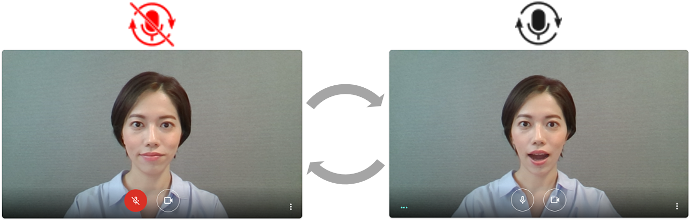
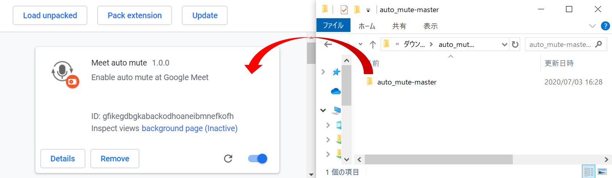
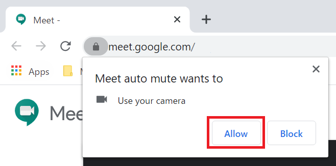
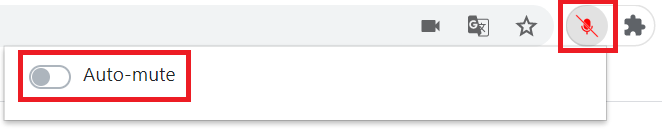
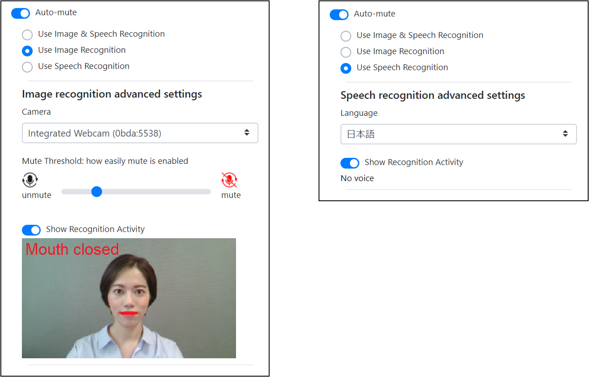

<a href="/README.md">[Language: English]</a>

# Auto Mute 
画像認識と音声認識により、[Google Meet](https://meet.google.com/) のミュート制御を自動で行う Chrome 拡張です。

## 動作環境
Google Chrome
* 動作確認済みバージョン: Chrome 83
* 最新版が望ましい

## インストール方法
1. `Code` ボタンから zip ファイルをダウンロードし、PC上で解凍してください。

2. `chrome://extensions` ページを開き、デベロッパーモードをONにしてください。

3. 解凍した auto_mute フォルダを `chrome://extensions` ページにドラッグ＆ドロップしてください。

## 使い方

1. [Google Meet](https://meet.google.com/) を開き、ブラウザにカメラとマイクの使用を許可してください。

2. 画像認識と音声認識により、自動でミュート制御が行われます。

3. Auto Mute アイコンをクリックすることで、Auto-mute モードを切り替えることができます。

4. Auto-mute モードが有効な場合、設定の変更や認識状況の確認ができます。

